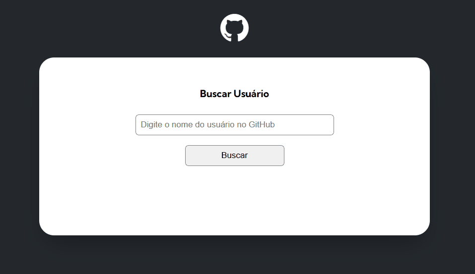

# Search Profile using Fetch and GitHub API

Exercício proposto de HTML + CSS + JS avançado que consiste em buscar um usuário do GitHub utilizando Fetch e a API do GitHub, mostrando suas informações de perfil, seus repositórios e seus eventos mais recentes.

## Tabela de Conteúdo

- [Desafio](#desafio)
- [Screenshot](#screenshot)
- [Ferramentas](#ferramentas)
- [Autora](#autora)

## Desafio

Para este projeto, o desafio foi a utilização da API do GitHub e identificar os elementos de cada objeto (tanto nas informações de perfil, como nos repositórios e eventos).

O próximo desafio após a obtenção dos objetos desejados foi mostrar na tela os dados, assim que o usuário for digitado no input, e fazer as validações necessárias para não terem dados indefinidos.

Com a ajuda da monitoria no DevQuest, foi possível melhorar o código utilizando os métodos filter() e slice() para mostrar os últimos 10 eventos do usuário, sendo somente dos tipos "CreateEvent" e "PushEvent".

## Screenshot

## Ferramentas

- HTML com semântica
- Estilização com CSS
- JavaScript (DOM e funções)
- [GitHub API](https://docs.github.com/pt/rest/guides/getting-started-with-the-rest-api?apiVersion=2022-11-28) / Requisições com fetch

## Autora

- LinkedIn - [Camila Katayama](https://www.linkedin.com/in/camila-katayama-ab1a42153/)
- GitHub - [@camilakataa](https://github.com/camilakataa)

